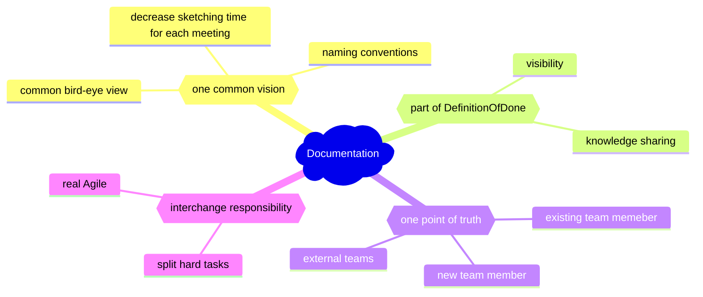

# Architecture cheat sheet
> Communication is more than half of the work of an Enterprise Architecture practice.  
> The real goal is to make your architecture easy enough to understand so that people can make the right decisions.  

## What architecture is:
* Architecture != Tools & Frameworks
* Postponing decisions about Tooling and frameworks
* Focus on customer, not environment

## Architecture trade-offs
* Build vs Buy
* Coding vs Configuration
* Product customization

## Architecture context

## Waterfall++ - [V-Model system design](https://en.wikipedia.org/wiki/V-model_(software_development))

## Design thinking
* emphasize
  * hot points
  * who is asking
  * no tech discussions
  * goals ( business, tech )
* define
  * deep understanding
  * questions
  * use cases
* idea
  * how to 
  * solution architecture
* prototype
  * implementation
* test

## Architecture Decision Records
* Priority
* Stakeholders
* Status
* Owners ( lead of activities )
* Assumptions
* Risks

## resilient architecture
* Timeouts
* Graceful Degradation
* Retries
* Exponential Backoff
* Circuit Breakers

## Application general schema, application demands
* development
* operations
* support
  * L1
  * L2
  * L3
* data migration ( for evolution/revolution )

# Why software architecture

## Why to make a documentation:

## Examples

## Useful links
* [EIP](https://www.enterpriseintegrationpatterns.com/ramblings.html)
* [C4](https://leanpub.com/visualising-software-architecture)
* [C4 model](https://c4model.com/)
* 97 things every architect should know
* [value proposition template](https://www.strategyzer.com/canvas/value-proposition-canvas)
* [12 factors app](https://12factor.net/)
* [system design descriptions](https://github.com/ByteByteGoHq/system-design-101)
* [design patterns](https://github.com/DovAmir/awesome-design-patterns)
* Quality control ( intentionally in russian due to lack of information in other languages )
  **[семь инструментов контроля качества](https://stump.ru/types/sem-instrumentov-kachestva-sem-novyh-metodov-upravleniya-kachestvom/)**
  * [диаграмма ishikawa](https://ru.wikipedia.org/wiki/%D0%94%D0%B8%D0%B0%D0%B3%D1%80%D0%B0%D0%BC%D0%BC%D0%B0_%D0%98%D1%81%D0%B8%D0%BA%D0%B0%D0%B2%D1%8B)
  * [контрольная карта](https://ru.wikipedia.org/wiki/%D0%9A%D0%BE%D0%BD%D1%82%D1%80%D0%BE%D0%BB%D1%8C%D0%BD%D0%B0%D1%8F_%D0%BA%D0%B0%D1%80%D1%82%D0%B0_%D0%A8%D1%83%D1%85%D0%B0%D1%80%D1%82%D0%B0)
  * [диаграмма Парето](https://ru.wikipedia.org/wiki/%D0%94%D0%B8%D0%B0%D0%B3%D1%80%D0%B0%D0%BC%D0%BC%D0%B0_%D0%9F%D0%B0%D1%80%D0%B5%D1%82%D0%BE)
  * [гистограмма](https://ru.wikipedia.org/wiki/%D0%93%D0%B8%D1%81%D1%82%D0%BE%D0%B3%D1%80%D0%B0%D0%BC%D0%BC%D0%B0)
  * [контрольный лист](https://ru.wikipedia.org/wiki/%D0%9A%D0%BE%D0%BD%D1%82%D1%80%D0%BE%D0%BB%D1%8C%D0%BD%D1%8B%D0%B9_%D1%81%D0%BF%D0%B8%D1%81%D0%BE%D0%BA)
  * [расслоение](https://ru.wikipedia.org/w/index.php?title=%D0%A0%D0%B0%D1%81%D1%81%D0%BB%D0%BE%D0%B5%D0%BD%D0%B8%D0%B5_(%D1%81%D1%82%D1%80%D0%B0%D1%82%D0%B8%D1%84%D0%B8%D0%BA%D0%B0%D1%86%D0%B8%D1%8F)&action=edit&redlink=1)
  * [диаграмма рассеяния](https://ru.wikipedia.org/wiki/%D0%94%D0%B8%D0%B0%D0%B3%D1%80%D0%B0%D0%BC%D0%BC%D0%B0_%D1%80%D0%B0%D1%81%D1%81%D0%B5%D1%8F%D0%BD%D0%B8%D1%8F)
  * [дополнительные 7 инструментов контроля качества](https://dzen.ru/a/ZaQAos7VpGMZqodh)
    * диаграмма сродства
    * диаграмма зависимостей ( связей )
    * системная (древовидная) диаграмма
    * матричная диаграмма
    * стрелочная диаграмма
    * диаграмма планирования оценки процесса
    * анализ матричных данных
    * схема потока

## [books](https://www.goodreads.com/shelf/show/software-architecture)
* Clean Architecture ( Robet C. Martin )
* Domain-Driven Design: Tackling Complexity in the Heart of Software
* Software Architecture in Practice ( Len Bass )
* Patterns of Enterprise Application Architecture ( Martin Fowler )
* Enterprise Integration Patterns ( Gregor Hohpe )
* The Software Architect Elevator ( Grehor Hohpe )
* 97 Things Every Software Architect Should Know ( Richard Monson )
* 37 Things One Architect Knows ( Gregor Hohpe )
* Software Architecture Patterns ( Mark Richards )
