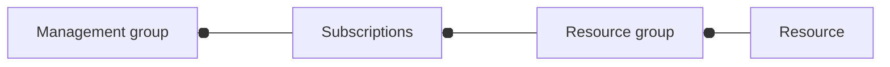

# Microsoft Azure

## Links 
- [admin panel](https://admin.microsoft.com)
- [course](https://aka.ms/az900)
- [course](https://aka.ms/CourseAZ-900)

## Trainings 
- [trainings for playing](https://learn.microsoft.com/en-us/training/)
- [azure trainings](https://learn.microsoft.com/en-us/training/azure/)
- [shell](https://aka.ms/cli_ref)
- [training for basics in cli](https://learn.microsoft.com/en-us/training/modules/introduction-to-azure-developer-cli/)
- [training create resources via cli](https://learn.microsoft.com/en-us/training/modules/create-azure-resources-by-using-azure-cli/)

```sh
bash  # switch to bash instead of power-shell
az version

az --help
az upgrade
az interactive
```

## Subscriptions
- Dev
- Test
- Production

## Basement

## AZURE services 

### Azure Functions 
TODO: Research and document how to integrate **Azure Functions** with **KEDA** (Kubernetes Event-driven Autoscaling).

### Azure Compute Services
TODO: Review, compare, and understand the use cases for **VM**, **Desktop**, **Container**, and **App Service**.

### Storage

#### Storage Account Web Hosting
TODO: Look into using an **Azure Storage Account** to host an HTTP-based static website.

#### Storage Redundancy & Durability
TODO: **Storage Redundancy** strategies and how they ensure data **Durability** across different tiers.

### Microsoft Entra ID (Identity & Access Management)
* the core pillars of identity management in 
* **Microsoft Entra ID**:
  * **Authentication** 
    * **Multi-factor** authentication
  * **Authorization**
  * Biometrics / Identity features **( "G... face human")**

### Microsoft Azure Marketplace
TODO: Explore and understand the **Microsoft Azure Marketplace** ecosystem and available third-party solutions.

### Total Cost of Ownership (TCO)
TODO: Compare the **Total Cost of Ownership (TCO)** for **On-Premises vs. Azure** infrastructure deployments.

### Resource Locks
Utilize Azure **Resource Locks** to prevent accidental modifications or loss:
* **Delete** (`CanNotDelete`)
* **R/Only** (`ReadOnly`)

### Azure CLI Command - az 
TODO: install

### Azure Advisor & Service Health
* **Azure Advisor:** For personalized best practices regarding optimization, security, and cost.
* **Azure Service Health:** For monitoring active cloud issues, planned maintenance, and health advisories.