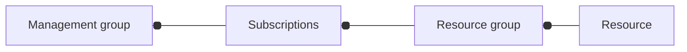

# Microsoft Azure

## Links 
- [admin panel](https://admin.microsoft.com)
- [course](https://aka.ms/az900)
- [course](https://aka.ms/CourseAZ-900)

## Trainings 
- [trainings for playing](https://learn.microsoft.com/en-us/training/)
- [azure trainings](https://learn.microsoft.com/en-us/training/azure/)
- [shell](https://aka.ms/cli_ref)
- [training for basics in cli](https://learn.microsoft.com/en-us/training/modules/introduction-to-azure-developer-cli/)
- [training create resources via cli](https://learn.microsoft.com/en-us/training/modules/create-azure-resources-by-using-azure-cli/)

```sh
bash  # switch to bash instead of power-shell
az version

az --help
az upgrade
az interactive
```

## Subscriptions
- Dev
- Test
- Production

## Basement

