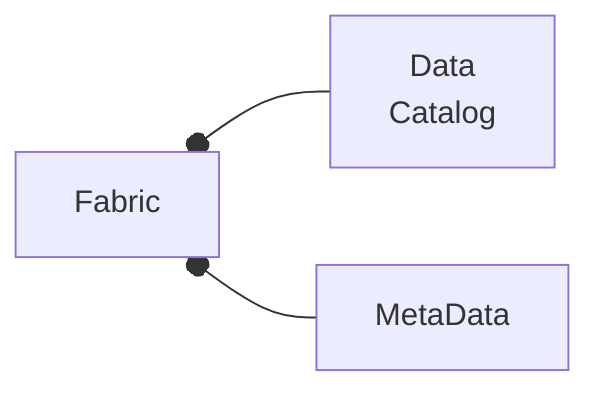
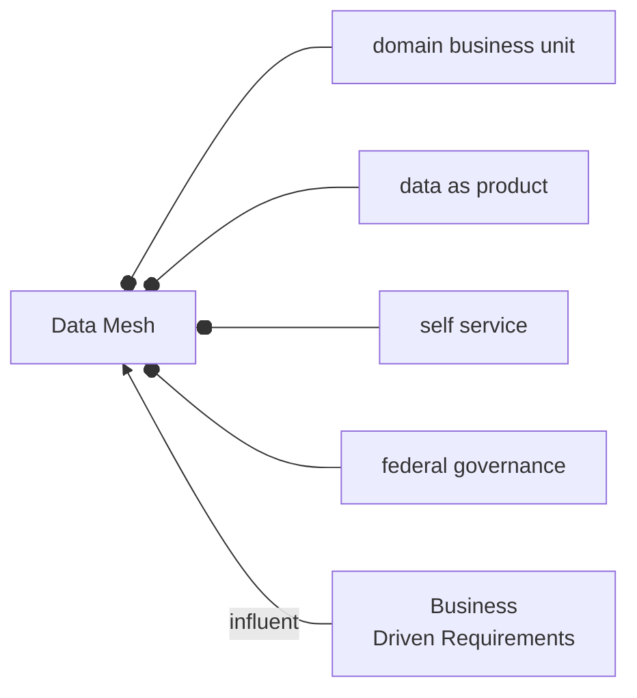

# Big Data 
* [mapr](./mapr-cheat-sheet.md)
* [hadoop](./hadoop-cheat-sheet.md)
* [hbase](./hbase-cheat-sheet.md)
* [helm](./helm-cheat-sheet.md)
* [hive](./hive-cheat-sheet.md)
* [pig](./pig-cheat-sheet.md)
* [nosql](./nosql.md)
* [spark](./spark-cheat-sheet.md)
* [airflow](./airflow-cheat-sheet.md)
* [bigsql](./bigsql-cheat-sheet.md)
* [cassandra](./cassandra-cheat-sheet.md)

## DataDriven Culture

