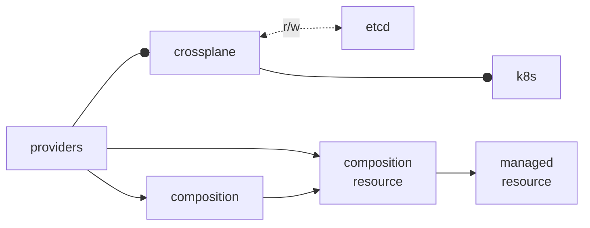

# Crossplane
* K8S extension for managing resources of K8S and **non-K8S** via ([providers](https://github.com/crossplane-contrib/)) with watching a state for them.  
* Similar to Terraform and Pulumi ( and can manage them )  
* CLI interface

## Namespace
```
namespace: crossplane-system
kind: managed resource
```
deployments
```
> kubectl get deployments -n crossplane-system
NAME                      READY   UP-TO-DATE   AVAILABLE 
crossplane                1/1     1            1         
crossplane-rbac-manager   1/1     1            1         
```

## Resources


## resolve issues 
* resource map
* logs

## Links
* [crossplane doc](https://docs.crossplane.io/)
* [crossplane installation](https://docs.crossplane.io/latest/software/install/)
* [crossplane github](https://github.com/crossplane/crossplane)
* [providers](https://github.com/crossplane-contrib/)  
  [provider aws in marketplace](https://marketplace.upbound.io/providers/upbound/provider-family-aws)  

