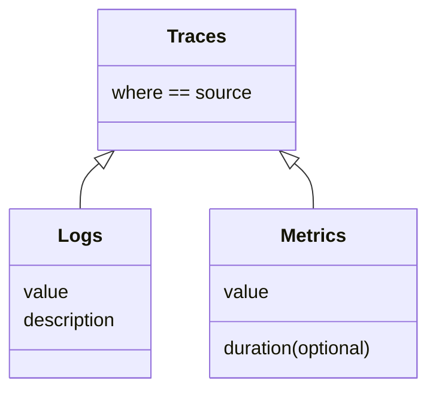
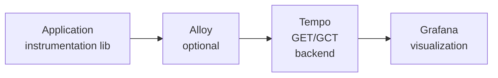

# Grafana cheat sheet

## Links
* [grafana dashboards collection](https://grafana.com/grafana/dashboards/)
* [grafana playground](https://play.grafana.org/)
* [grafana ai helper grot](https://grafana.com/grot/)
  * [how to use grot](https://grafana.com/blog/2025/05/07/llm-grafana-assistant/)
* [grafana free version](https://fatjon.grafana.net)
* [grafana demo instance](https://psdemo.grafana.net/a/grafana-setupguide-app/home)

## Grafana Ecosystem / Stack
* [Grafana Mimir](https://grafana.com/oss/mimir) - open TSDB 
  > can store metrics from Prometheus, Graphite
* Loki - open source log aggregator
  > can store logs to S3, Google Cloud
  > [how to run faster loki queries](https://grafana.com/blog/2023/07/05/how-to-run-faster-loki-metric-queries-with-more-accurate-results/)
* Tempo - open source tracing backend
  > can be used with: OpenTelemetry, Jaeger, Zipkin ...

## [Grafana sources](https://grafana.com/grafana/plugins)

### logs ( what happend )
* splunk ( logs )
* elastic 
### metrics ( something happend )
> example: amount of system resources, server response, number of concurent users
* Prometheus ( metrics )
### traces ( where it happens)
> instrumentaion SDKs: OpenTelemetry, Jaeger, Zipkin
* appdynamics

## Grafana Traces solution


## [Grafana plugins](https://grafana.com/grafana/plugins)
* Data Sources
* Applications
* Panels

## LogQL
### general

### aggregation operators
* sum
* avg
* min
* max
* stddev
* stdvar
* count
* topk
* bottomk

## Docker images
* [standalone grafana](https://github.com/cherkavi/docker-images/blob/master/grafana/README.md)
* [part of TICK stack](https://github.com/cherkavi/docker-images/blob/master/telegraf/README.md)
* [prometheus with grafana](https://github.com/cherkavi/docker-images/blob/master/prometheus/README.md#alerts--prometheus--grafana)

## [rest api documentation](https://grafana.com/docs/grafana/latest/developers/http_api/)
```sh
GRAFANA_HOST=grafana-monitoring.vantage.zur
GRAFANA_URL=https://$GRAFANA_HOST
TOKEN=866d56cc....
curl -X GET -H "Authorization: Bearer $TOKEN" ${GRAFANA_URL}/api/users?perpage=10&page=1
```
