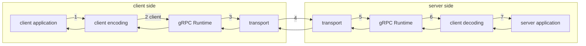

# gRPC

## links
* [gRPC Official Documentation](https://grpc.io/docs/)
* [gRPC GitHub Repository](https://github.com/grpc/grpc)
* [gRPC Tutorials and Examples](https://grpc.io/docs/quickstart/)

## 
