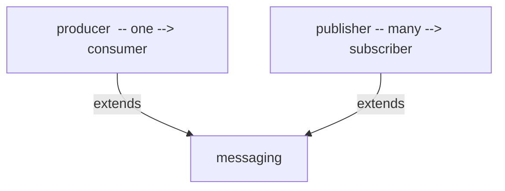
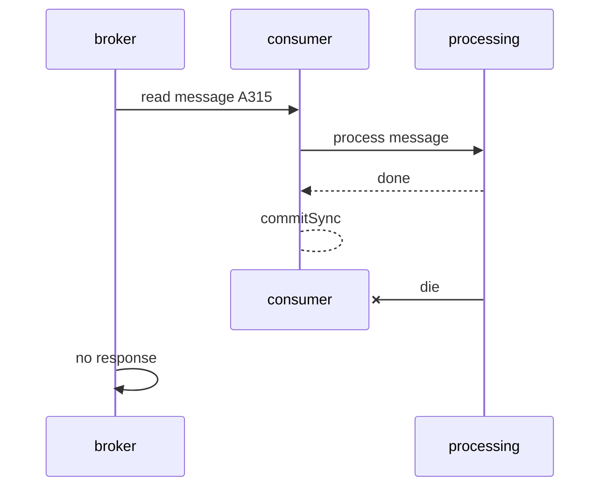
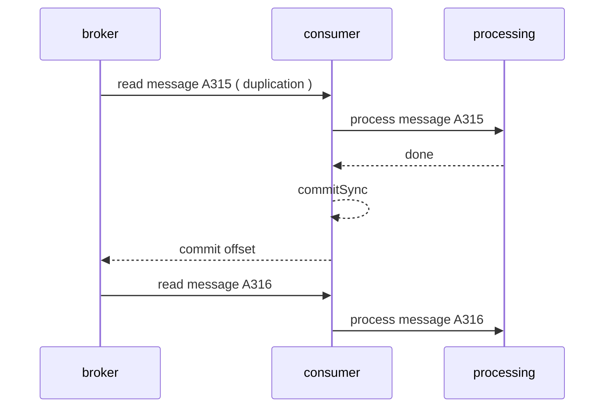
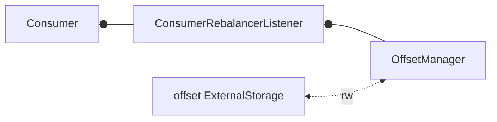
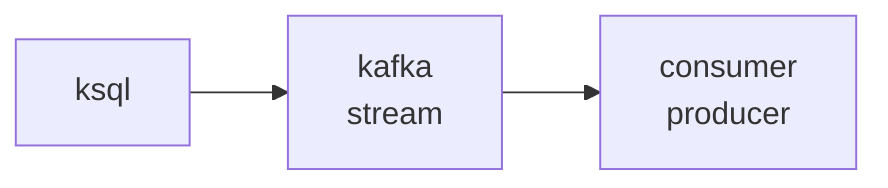
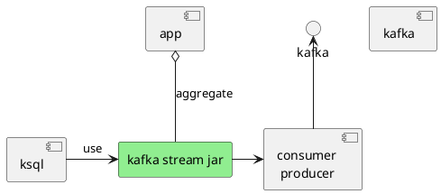

# Kafka cheat sheet
[position in architecture ](https://github.com/cherkavi/cheat-sheet/blob/master/architecture-cheat-sheet.md#communication-between-applications)  


## **Kafka guarantees**
* messages that sent into particular topic will be appended in the same order
* consumer see messages in order that were written
* "At-least-once" message delivery guaranteed - for consumer who crushed before it commited offset
* "At-most-once" delivery - ( custom realization ) consumer will never read the same message again, even when crushed before process it

## Best practice
* it is better to have many small messages instead of big one
* Integration tests should have real-world messages

## [source code](https://kafka.apache.org/code)
```sh
git clone https://github.com/apache/kafka.git kafka
```
or [kafka download](https://kafka.apache.org/downloads)

## main concepts
* Topics
category of messages, consists from Partitions
* Partition ( Leader and Followers )
part of the Topic, can be replicated (replication factor) across Brokers, must have at least one Leader and 0..* Followers
when you save message, it will be saved into one of the partitions depends on:
partition number | hash of the key | round robin  
[partition size calculator](https://www.eventsizer.io)  
  
* Leader
main partition in certain period of time, contains InSyncReplica's - list of Followers that are alive in current time
* Committed Messages
when all InSyncReplicas wrote message, Consumer can read it after, Producer can wait for it or not
* Brokers
one of the server of Kafka ( one of the server of cluster )
* Producers
some process that publish message into specific topic
* Consumers
topics subscriber
* Consumer Group
group of consumers, have one Load Balancer for one group, 
consumer instance from different group will receive own copy of message ( one message per group )

  
  
  
  
  
  
  
 

[Error Handling](https://eng.uber.com/reliable-reprocessing/)

### consumer messages processing
[code examples](https://dzone.com/articles/kafka-clients-at-most-once-at-least-once-exactly-o)
#### At most once
> offset controlled by timer
```
enable.auto.commit=true;     # Kafka would auto commit offset at the specified interval.
# !!! do not make call to consumer.commitSync(); from the consumer. With this configuration of consumer, 
auto.commit.interval.ms=1;   # set it to lower timeframe
```

#### At-least-once 
> offset controlled by broker
scenario happens when consumer processes a message and commits the message into its persistent store and consumer crashes at that point, haven't commit to kafka broker
Duplicate message delivery could happen in the following scenario.
```quarkus.kafka-streams.processing-guarantee=at_least_once```
```
enable.auto.commit=false  #  enable.auto.commit=true and auto.commit.interval.ms=999999999999999
# consumer.commitSync(); # After reading. Consumer should now then take control of the message offset commits
```





#### Exactly once
> offset controlled by consumer in external storage
```quarkus.kafka-streams.processing-guarantee=exactly_once # exactly_once_v2```
```
enable.auto.commit=false
# !!! do not make call to consumer.commitSync(); 
# use new KafkaConsumer<String, String>(props).subscribe("topic", ConsumerRebalancerListener)

```



## ZoopKeeper ( one instance per cluster )
* must be started before using Kafka ( zookeeper-server-start.sh, kafka-server-start.sh )
* cluster membership
* electing a controller
* topic configuration
leader, which topic exists
* Quotas
* ACLs
  ```sh
  ./kafka-acls.sh
  ```

## scripts
### start Kafka's Broker
```sh
zookeeper-server-start.sh
kafka-server-start.sh config/server.properties
```

## ksql



### ksql ( MapR )
#### create stream 
```sh
# create stream
maprcli stream create -path sample-stream -produceperm p -consumeperm p -topicperm p

# generate dummy data 
/opt/mapr/ksql/ksql-4.1.1/bin/ksql-datagen quickstart=pageviews format=delimited topic=sample-stream:pageviews  maxInterval=5000
```
#### create table for stream
```sh
/opt/mapr/ksql/ksql-4.1.1/bin/ksql http://ubs000130.vantage.org:8084
```

#### ksqldb what is 
it is storage of messages with ability to look 
into window ( time based ) using ConfluenceKafkaSQL

#### ksqldb pillars
* stream processing
* connectors
* mater. views

#### ksqldb queries
* pull query
* push query
```sql
create table pageviews_original_table (viewtime bigint, userid varchar, pageid varchar) with (kafka_topic='sample-stream:pageviews', value_format='DELIMITED', key='viewtime')
select * from pageviews_original_table;
```


### topic create
```sh
bin/kafka-topics.sh --create --zookeeper localhost:2181 --replication-factor 1 --partitions 1 --topic mytopic
bin/kafka-topics.sh --create --zookeeper localhost:2181 --replication-factor 1 --partitions 1 --describe --topic mytopic
bin/kafka-topics.sh --create --zookeeper localhost:2181 --replication-factor 1 --partitions 1 --config retention.ms=360000 --topic mytopic
```
or just enable "autocreation"
```
auto.create.topics.enable=true
```

### topic delete
can be marked "for deletion"
```sh
bin/kafka-topics.sh --delete --zookeeper localhost:2181 --topic mytopic
```

### topics list
```sh
bin/kafka-topics.sh --create --zookeeper localhost:2181 --list
```

### topics describe
```sh
kafka-topics --describe --zookeeper localhost:2181 --topic mytopicname
```

### topic update
```
bin/kafka-topics.sh --alter --zookeeper localhost:2181 --partitions 5 --topic mytopic
bin/kafka-topics.sh --alter --zookeeper localhost:2181 --topic mytopic --config retention.ms=72000
bin/kafka-topics.sh --alter --zookeeper localhost:2181 --topic mytopic --deleteConfig retention.ms=72000
```

## [Producer](https://docs.confluent.io/current/clients/producer.html)

### producer console
```sh
bin/kafka-console-producer.sh --broker-list localhost:9092 --topic mytopic

PRODUCER_CONFIG=/path/to/config.properties
TOPIC_NAME=my-topic
BROKER=192.168.1.140:9988
bin/kafka-console-producer.sh --producer.config $PRODUCER_CONFIG \
--broker-list $BROKER --topic $TOPIC_NAME
```

### java producer example
```java
 Properties props = new Properties();
 props.put("bootstrap.servers", "localhost:4242");
 props.put("acks", "all");  // 0 - no wait; 1 - leader write into local log; all - leader write into local log and wait ACK from full set of InSyncReplications 
 props.put("client.id", "unique_client_id"); // nice to have
 props.put("retries", 0);           // can change ordering of the message in case of retriying
 props.put("batch.size", 16384);    // collect messages into batch
 props.put("linger.ms", 1);         // additional wait time before sending batch
 props.put("compression.type", ""); // type of compression: none, gzip, snappy, lz4
 props.put("buffer.memory", 33554432);
 props.put("key.serializer", "org.apache.kafka.common.serialization.StringSerializer");
 props.put("value.serializer", "org.apache.kafka.common.serialization.StringSerializer");
 Producer<String, String> producer = new KafkaProducer<>(props);
 producer.metrics(); // 
 for(int i = 0; i < 100; i++)
     producer.send(new ProducerRecord<String, String>("mytopic", Integer.toString(i), Integer.toString(i)));
     producer.flush(); // immediatelly send, even if 'linger.ms' is greater than 0
 producer.close();
 producer.partitionsFor("mytopic")
```
partition will be selected 

## Consumer
### [consumer console](https://github.com/apache/kafka/blob/trunk/core/src/main/scala/kafka/tools/ConsoleConsumer.scala) ( console consumer )
```sh
bin/kafka-console-consumer.sh --zookeeper localhost:2181 --topic mytopic --from-beginning
bin/kafka-console-consumer.sh --zookeeper localhost:2181 --topic mytopic --from-beginning --consumer.config my_own_config.properties

bin/kafka-console-consumer.sh --bootstrap-server mus07.mueq.adac.com:9092 --new-consumer --topic session-ingest-stage-1 --offset 20 --partition 0  --consumer.config kafka-log4j.properties
bin/kafka-console-consumer.sh --bootstrap-server mus07.mueq.adac.com:9092 --group my-consumer-2 --topic session-ingest-stage-1 --from-beginning  --consumer.config kafka-log4j.properties

# read information about partitions
java kafka.tools.GetOffsetShell --broker-list musnn071001:9092 --topic session-ingest-stage-1
# get number of messages in partitions, partitions messages count
bin/kafka-run-class.sh kafka.tools.GetOffsetShell --broker-list localhost:9092 --topic session-ingest-stage-1
```
### consumer group console
```sh
bin/kafka-consumer-groups.sh --zoopkeeper localhost:2181 --describe --group mytopic-consumer-group
```

### consumer offset
* automatic commit offset (enable.auto.commit=true) with period (auto.commit.interval.ms=1000)
* manual offset commit (enable.auto.commit=false)
* property "auto.offset.reset=latest" start with consuming only newly appeared messages in the topic after connection/creation

### [consumer configuration](https://kafka.apache.org/documentation/#consumerconfigs)
```java
 Properties props = new Properties();
 props.put("bootstrap.servers", "localhost:4242"); // list of host/port pairs to connect to cluster
 props.put("client.id", "unique_client_id");       // nice to have
 props.put("group.id", "unique_group_id");         // nice to have
 props.put("key.serializer", "org.apache.kafka.common.serialization.StringSerializer");
 props.put("value.serializer", "org.apache.kafka.common.serialization.StringSerializer");
 props.put("fetch.min.bytes", 0);              // if value 1 - will be fetched immediatelly
 props.put("enable.auto.commit", "true");      //
 // timeout of detecting failures of consumer, Kafka group coordinator will wait for heartbeat from consumer within this period of time
 props.put("session.timeout.ms", "1000"); 
 // expected time between heartbeats to the consumer coordinator,
 // is consumer session stays active, 
 // facilitate rebalancing when new consumers join/leave group,
 // must be set lower than *session.timeout.ms*
 props.put("heartbeat.interval.ms", "");
```

### consumer java
NOT THREAD Safe !!!
```java
KafkaConsumer<String, String> consumer = new KafkaConsumer<>(props);
ConsumerRecords<String, String> records = consumer.pool(100); // time in ms
```

### consumer consume messages
* by topic
```
consumer.subscribe(Arrays.asList("mytopic_1", "mytopic_2"));
```
* by partition
```
TopicPartition partition0 = new TopicPartition("mytopic_1", 0);
TopicPartition partition1 = new TopicPartition("mytopic_1", 1);
consumer.assign(Arrays.asList(partition0, partition1));
```
* seek to position
```
seek(partition0, 1024);
seekToBeginning(parition0, partition1);
seekToEnd(parition0, partition1);
```

## Kafka Stream State Stores
:TODO: in-memory DB ( Rocks DB )

## Kafka connect
* manage copying data between Kafka and another system
* connector either a source or a sink
* connector can split "job" to "tasks" ( to copy subset of data )
* *partitioned streams* for source/sink, each record into it: [key,value,offset]
* standalone/distributed mode
* Two ways of wokring with Stream:
  * [KSQL](#ksql) (KSQLDB)
  * Flink
    > engine for running queries on cluster

### Kafka connect standalone
start connect
```
bin/connect-standalone.sh config/connect-standalone.properties config/connect-file-source.properties
```
connect settings
```
name=local-file-source
connector.class=org.apache.kafka.connect.file.FileStreamSourceConnector
tasks.max=1
file=my_test_file.txt
topic=topic_for_me
```
after execution you can check the topic
```sh
bin/kafka-console-consumer.sh --zookeeper localhost:2181 --topic topic_for_me --from-beginning
```

## additional tools
### [cli tool](https://github.com/electric-saw/kafta)

### [kcat, Kafkacat](https://github.com/edenhill/kcat)
> kafka cli (producer & consumer)
* [how to use kcat](https://docs.confluent.io/platform/current/clients/kafkacat-usage.html)
* [how to use kcat](https://codingharbour.com/apache-kafka/learn-how-to-use-kafkacat-the-most-versatile-cli-client/)
#### installation
```sh
apt-get install kafkacat
```
docker run
```sh
docker run -it --network=host edenhill/kcat:1.7.1
```

#### commands
##### minimal command
```sh
BROKER_HOST=192.168.1.150
BROKER_PORT=3388
TOPIC=my-topic
kafkacat -C -b $BROKER_HOST:$BROKER_PORT -t $TOPIC
# -X security.protocol=sasl_ssl \
# -X sasl.mechanisms=PLAIN      \
# -X sasl.username=$SASL_USER   \
# -X sasl.password=$SASL_PASS   \
```

##### read all messages, read messages from the beginning
```sh
kafkacat -C -b $BROKER_HOST:$BROKER_PORT -t $TOPIC -o beginning
```

#### read last messages, read messages from the end 
```sh
kafkacat -C -b $BROKER_HOST:$BROKER_PORT -t $TOPIC -o -5
```

#### Consume messages and stop 
```sh
kafkacat -C -b $BROKER_HOST:$BROKER_PORT -t $TOPIC -c 5
# Print messages with a specific output
kafkacat -C -b $BROKER_HOST:$BROKER_PORT -t $TOPIC -c 5 -f 'Key: %k, message: %s \n'
# more complex output
kafkacat -C -b $BROKER_HOST:$BROKER_PORT -t $TOPIC -c 5 -f '\nKey (%K bytes): %k\t\nValue (%S bytes): %s\nTimestamp: %T\tPartition: %p\tOffset: %o\nHeaders: %h\n--\n' -e
```

#### read messages in the time range, read messages between two datetimes
```sh
date_start=`date +'%Y-%m-%d %H:%M:%S' --date="2 hour ago"`
date_end=`date +'%Y-%m-%d %H:%M:%S'`

kafkacat -C -b $BROKER_HOST:$BROKER_PORT -t $TOPIC -o s@$date_start -o e@$date_end
```

#### read key of the message 
```sh
kafkacat -C -b $BROKER_HOST:$BROKER_PORT -t $TOPIC -K\t
```

#### read message with specific key
```sh
kafkacat -C -b $BROKER_HOST:$BROKER_PORT -t $TOPIC -o beginning -K\t | grep $MESSAGE_KEY
# shrink time of the scan from "beginning" to something more expected
```

#### write/produce message 
```sh
kafkacat -C -b $BROKER_HOST:$BROKER_PORT -t $TOPIC -c 5 -P -l /path/to/file
```
