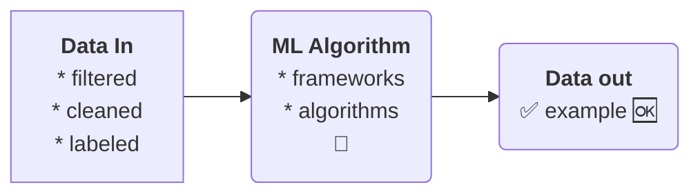

# Machine Learning

```mermaid
graph LR;
    A[<b>Data In</b>
    * filtered
    * cleaned
    * labeled
    ] --> 
    B(<b>ML Algorithm</b>
    * frameworks
    * algorithms
    🔄️
    );

    B --> 
    C(<b>Data out</b>
    ✅️ example 🆗️
    );    
```
