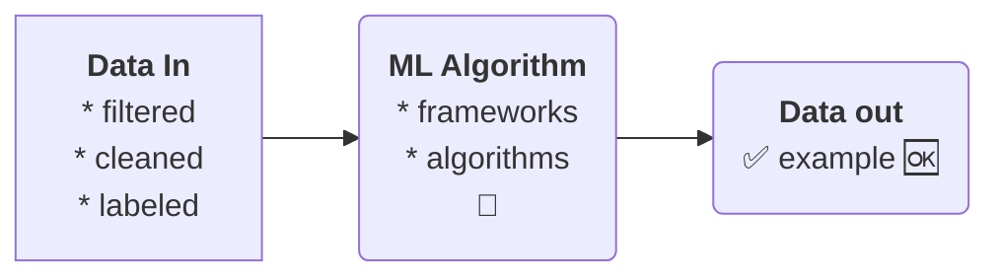

# Machine Learning

```mermaid
graph LR;
    A[<b>Data In</b>
    * filtered
    * cleaned
    * labeled
    ] --> 
    B(<b>ML Algorithm</b>
    * frameworks
    * algorithms
    🔄️
    );

    B --> 
    C(<b>Data out</b>
    ✅️ example 🆗️
    );    
```
## Frameworks
* ['double' ML](https://github.com/py-why/EconML/blob/main/README.md)
  `pip install econml`
* [Google Jupyter Notebook](https://colab.research.google.com/)
* 
