# Machine Learning
TODO: python framework mataflow `from metaflow import FlowSpec, step `
TODO: python framework sklearn `from sklearn.pipeline import Pipeline`

```mermaid
graph LR
    A[<b>Data In</b>
    * filtered
    * cleaned
    * labeled
    ] ----> 
    B(<b>ML Algorithm</b>
    * frameworks
    * algorithms
    🔄️
    )
    B --> 
    C(<b>Data out</b>
    ✅️ example 🆗️
    )    
```

## Necessary knowledges

### design
  * Requirement engineering
  * ML UseCases prioritization
  * Data Availability Check
### model development
  * Data Engineering
  * ML Model Engineering
  * Model Testing & Validation
### operations
  * ML Model Deployment
  * CI/CD pipelines
  * Monitoring & triggering