# PlantUML

## Links
* [online editor](https://www.plantuml.com/plantuml/uml)
* [official website](https://plantuml.com/)
* [guide](https://crashedmind.github.io/PlantUMLHitchhikersGuide/index.html)
* [documentation](https://plantuml-documentation.readthedocs.io/en/latest)
* [source code](https://github.com/plantuml/plantuml)
* [standard library](https://github.com/plantuml/plantuml-stdlib/tree/master)
* examples:
  * https://plantuml.com/sequence-diagram
  * https://plantuml.com/use-case-diagram
  * https://plantuml.com/class-diagram
  * https://plantuml.com/activity-diagram-beta
  * https://plantuml.com/component-diagram
  * https://plantuml.com/state-diagram
  * https://plantuml.com/object-diagram
  * https://plantuml.com/deployment-diagram
  * https://plantuml.com/timing-diagram
  * https://plantuml.com/archimate-diagram
## local start
### [start in docker](https://github.com/plantuml/plantuml-server)
```sh
docker run -d --name plantuml_local -p 3344:8080 plantuml/plantuml-server:jetty
```
### plantuml inside VisualCode
```sh
"plantuml.fileExtensions": ".wsd,.pu,.puml,.plantuml,.iuml,.md",
# "plantuml.server": "https://plantuml-mci.bmwgroup.net/",
"plantuml.server": "http://localhost:3344",
"plantuml.render": "PlantUMLServer",    
```

## guide excerpts
### elements
```plantuml
allowmixing
scale 500 width
' participant participant
actor       [actor\n<b><color:blue>Vasya</color></b> and Co]
boundary    boundary   #yellow
control     control    #ff0
entity      entity     #ffaa00
database    database   
collections collections
queue       queue

usecase usecase

json doc_json{
    "key":"bbb","key2":"bbb"
}

component component{
    port port1
    portin port2
    portout port3
}

action action
actor actor
actor/ "actor/"
agent agent
artifact artifact
boundary boundary
card card
circle circle
cloud cloud
collections collections
component component
control control
database database
entity entity
file file        #lightgreen
folder folder
frame frame
hexagon hexagon
interface interface
label label
node node
package package
person person
process process
queue queue
rectangle rectangle
stack stack
storage storage
usecase usecase
usecase/ "usecase/"
```
archimate
```plantuml
listsprite
```
```plantuml
rectangle "Information" <<$archimate/business-collaboration>> #Business
rectangle "File" <<$archimate/technology-artifact>> #Technology
```
### include elements from standard libraries
```sh
git clone https://github.com/plantuml/plantuml-stdlib.git
cd plantuml-stdlib
# components
grep -r '^!define' | grep archimate
```
```plantuml
' https://github.com/plantuml/plantuml-stdlib/blob/master/archimate/Archimate.puml  
'                                                         archimate/Archimate.puml
!include <archimate/Archimate>
Application_Component(c1, "app1")
Technology_Artifact(f1, "file1")
Rel_Access_r(c1,f1)
```
### include symbols add sprites
```sh
git clone https://github.com/plantuml/plantuml-stdlib.git
cd plantuml-stdlib
# components
grep -r '^sprite' | grep database
```
```
' it doesn't work
!include tupadr3/font-awesome-6/database
listsprite
```
```plantuml
' https://github.com/tupadr3/plantuml-icon-font-sprites/blob/main/icons/font-awesome/index.md
'
' https://github.com/plantuml/plantuml-stdlib/blob/master/tupadr3/font-awesome-6/database.puml
'                                                         tupadr3/font-awesome-6/database
!include <tupadr3/font-awesome-6/database>
a ==right=> b #red :<s><size:20><color:green> question <$database>
b -up-> c : question 👀
```
custom sprites

```plantuml
@startuml
sprite foo1 <svg viewBox="0 0 36 36">
<path fill="#77B255" d="M36 32c0 2.209-1.791 4-4 4H4c-2.209 0-4-1.791-4-4V4c0-2.209 1.791-4 4-4h28c2.209 0 4 1.791 4 4v28z"/>
<path fill="#FFF" d="M21.529 18.006l8.238-8.238c.977-.976.977-2.559 0-3.535-.977-.977-2.559-.977-3.535 0l-8.238 8.238-8.238-8.238c-.976-.977-2.56-.977-3.535 0-.977.976-.977 2.559 0 3.535l8.238 8.238-8.258 8.258c-.977.977-.977 2.559 0 3.535.488.488 1.128.732 1.768.732s1.28-.244 1.768-.732l8.258-8.259 8.238 8.238c.488.488 1.128.732 1.768.732s1.279-.244 1.768-.732c.977-.977.977-2.559 0-3.535l-8.24-8.237z"/>
</svg>

Converter1  ==> Converter2 : "     symbol <$foo1*0.5> "

@enduml
```


### hide elements, remove elements
```plantuml
node node1 as n1
interface a
' remove node1
' hide node1
n1 --> a
```

### elements position 
```plantuml
a .down.>> b          :down
b ~right~* c         :right
c -up[hidden]-> d    :up  /' hide connection '/
d =left=o a          :left
```

### connection arrow style
```plantuml
a -right[#red,dashed,thickness=5]-> b  :<s><b><i><size:15><color:green><font:arial> down <$database>
```

### comments
```plantuml
/' 
multi line
comment 
'/
component a
' note example
note top of a: hello 
' multiline note example 
note right of a /' top, left, right, bottom, '/
  multi 
  line
  description
end note
```
### colors
```plantuml
colors
```
### directions
```plantuml
left to right direction /' try to comment this line '/

actor User
User -- guc
User -- fuc
```
### themes
```plantuml
help themes
```
```plantuml
!theme black-knight
actor a
interface b 
a -right-> b
```
### skins
* https://plantuml-documentation.readthedocs.io/en/latest/formatting/all-skin-params.html
* https://plantuml.com/skinparam
#### fonts, text 
```plantuml
skinparam actorFontSize 20
skinparam actorFontName arial
skinparam actorFontStyle bold
skinparam actorFontColor red
skinparam interfaceFontColor blue

actor A
interface B
```
#### color, highlight element
```plantuml
left to right direction
skinparam backgroundColor lightblue
skinparam handwritten true

skinparam component {    
    BorderColor red
    LineColor black
    LineThickness 5
    LineType dashed
    BackgroundColor gold
    BackgroundColor<<Anchor1>> yellow
    ArrowFontName arial
    ArrowFontColor #777777
    ArrowColor white 
    ArrowHeadColor purple
    ArrowStyle dashed /' dotted '/
    FontColor lightblue    
} 
component Orion as A #red-green 
component Sirius as B <<Anchor1>>
A --> B : hello
```
```plantuml
skinparameters 
```