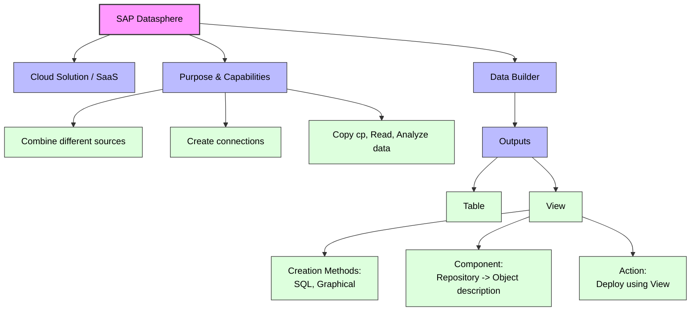

# SAP Datasphere

**How to read it:**
*   **Pink Node:** The main subject (SAP Datasphere).
*   **Blue Nodes:** The core categories (Type, Purpose, Tool, Outputs).
*   **Green Nodes:** The specific details and actions from your notes. 

## Database - Derby