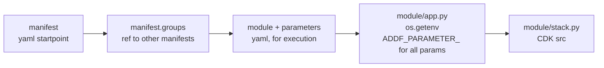

# seedfarmer
* [seedfarmer](https://seed-farmer.readthedocs.io/en/stable/index.html)
* [seedfarmer architecture](https://seed-farmer.readthedocs.io/en/stable/architecture.html#method-of-processing)
* [Autonomous Driving Data Framework](https://github.com/awslabs/autonomous-driving-data-framework)
* [seedfarmer example](https://github.com/zaremb/seedfarmer-training )
* [seedfarmer aws labs](https://github.com/awslabs/seed-farmer)
* [seedfarmer.manifest.path](https://developer.hashicorp.com/terraform/language/modules/sources#generic-git-repository)

### deployment 
[execute before](#project-init)
```sh
seedfarmer apply manifests/realm-infra/deployment.yaml --dry-run 
seedfarmer apply manifests/realm-infra/deployment.yaml
# seedfarmer apply manifests/realm-infra/deployment.yaml --dry-run --env-file config/local.env
```

### information about deployment/modules/parameters
[execute before](#project-init)
```sh
seedfarmer list deployments 
DEPLOYMENT=rff-$NAMESPACE

seedfarmer list modules --deployment $DEPLOYMENT
seedfarmer list allmoduledata --deployment $DEPLOYMENT 2>/dev/null | jq .

seedfarmer list moduledata --deployment $DEPLOYMENT --group oao       --module event-receiver     2>/dev/null | jq .
seedfarmer list moduledata --deployment $DEPLOYMENT --group oao       --module event-publisher    2>/dev/null | jq .
seedfarmer list moduledata --deployment $DEPLOYMENT --group dbbs      --module method-registry    2>/dev/null | jq .
seedfarmer list moduledata --deployment $DEPLOYMENT --group dbbs      --module method-runs-store  2>/dev/null | jq .
seedfarmer list moduledata --deployment $DEPLOYMENT --group dbbs      --module requests-store     2>/dev/null | jq .
seedfarmer list moduledata --deployment $DEPLOYMENT --group event-bus --module event-bus          2>/dev/null | jq .
seedfarmer list moduledata --deployment $DEPLOYMENT --group lambdas   --module dispatcher         2>/dev/null | jq .
seedfarmer list moduledata --deployment $DEPLOYMENT --group lambdas   --module aggregator         2>/dev/null | jq .

seedfarmer list deployspec --deployment $DEPLOYMENT --group lambdas --module aggregator 

seedfarmer list dependencies --deployment $DEPLOYMENT --group lambdas --module aggregator 

# seedfarmer list buildparams --deployment $DEPLOYMENT --group lambdas --module aggregator 
```

### check deployed services
[execute before](#project-init)
```sh

TABLE_NAME="method-registry-vitalii"
aws dynamodb describe-table     --table-name    $TABLE_NAME --query "Table.TableArn" --output text
TABLE_NAME="method-runs-vitalii"
aws dynamodb describe-table     --table-name    $TABLE_NAME --query "Table.TableArn" --output text
TABLE_NAME="request-store-vitalii"
aws dynamodb describe-table     --table-name    $TABLE_NAME --query "Table.TableArn" --output text

EVENTBUS_NAME="rff-vitalii-dev-eu-central-1-realm-bus"
aws events   describe-event-bus --name $EVENTBUS_NAME --query "Arn" --output text
EVENTBUS_NAME="method-requests-vitalii"
aws events   describe-event-bus --name $EVENTBUS_NAME --query "Arn" --output text
EVENTBUS_NAME="rff-vitalii-dev-eu-central-1-realm-bus"
aws events   describe-event-bus --name $EVENTBUS_NAME --query "Arn" --output text

FUNCTION_NAME='dispatcher-vitalii'
aws lambda   get-function       --function-name $FUNCTION_NAME --query "Configuration.FunctionArn" --output text
FUNCTION_NAME='aggregator-vitalii'
aws lambda   get-function       --function-name $FUNCTION_NAME --query "Configuration.FunctionArn" --output text
```

### check codeseeder internal artifacts
#### codeseeder bundles
```sh
code_seeder_bucket=`aws s3 ls | grep codeseeder | awk '{print $3}'`
aws s3 ls --recursive s3://$code_seeder_bucket
# read one of the bundle
path_to_file=codeseeder/bundle.zip
aws s3api get-object --bucket $code_seeder_bucket --key=$path_to_file bundle.zip
```

#### codeseeder parameter store
```sh
aws ssm describe-parameters --query "Parameters[].Name" | grep rff 
aws ssm get-parameter --name /addf/rff-vitalii/manifest/deployed --query "Parameter.Value" | tr '\\"' '"' | sed 's/""/"/g' | awk -F 'not_existing_value' '{print substr($0, 2, length($0)-1)}' | jq .

aws ssm describe-parameters --query "Parameters[].Name" | grep rff 
```

### remove deployment, destroy deployment
[execute before](#project-init)
```sh
seedfarmer destroy rff-$NAMESPACE
# seedfarmer destroy rff-$NAMESPACE --region $AWS_REGION --env-file config/local.env
```

## How to build it
